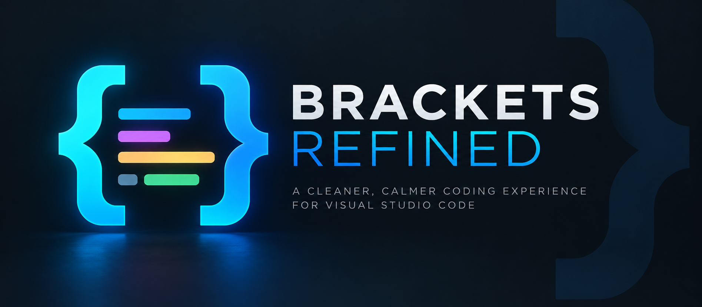
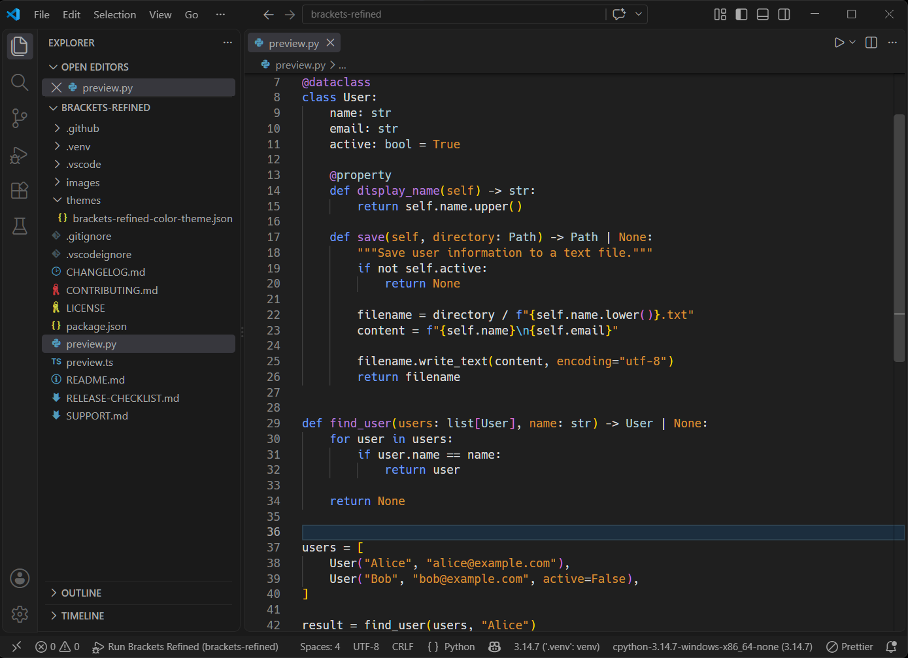
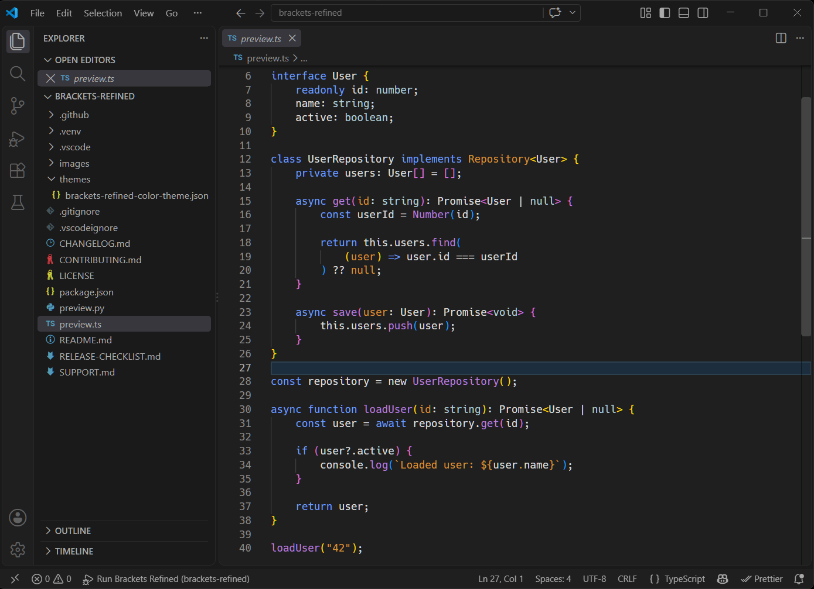

# Brackets Refined

<p align="center">
  
</p>

<p align="center">
  A carefully refined dark theme inspired by Brackets, rebuilt for modern Visual Studio Code.
</p>

---

## About

**Brackets Refined** brings the clean, focused character of Brackets into a modern Visual Studio Code environment.

Rather than reproducing the original Brackets appearance literally, the theme refines its visual language for current VS Code features: semantic highlighting, modern workbench components, diagnostics, Git integration, terminal colors, symbol icons, and language-aware syntax highlighting.

The result is a dark theme designed to remain calm and readable while preserving clear visual separation between important code elements.

## Screenshots

### Python

<p align="center">
  
</p>

### TypeScript

<p align="center">
  
</p>

## Key Features

- Near-black `#181A1B` editor background
- Carefully balanced dark workbench
- Semantic highlighting enabled
- Distinct functions, types, variables, parameters, properties, and constants
- Dedicated decorator highlighting
- Refined diagnostics and status colors
- Coordinated terminal ANSI palette
- Consistent symbol icons
- Git and diff colors integrated with the theme palette
- Tuned and tested with Python/Pylance
- Tuned and tested with TypeScript/JavaScript
- TextMate fallbacks for tokens not covered by semantic highlighting

## Syntax Palette

| Element | Color |
| --- | --- |
| Functions & Methods | `#74B9FF` |
| Classes & Interfaces | `#E5C07B` |
| Namespaces | `#56B6C2` |
| Type Parameters | `#C678DD` |
| Keywords | `#C678DD` |
| Operators | `#56B6C2` |
| Parameters | `#D19A66` |
| Constants | `#D19A66` |
| Variables | `#E8E8E8` |
| Properties | `#56B6C2` |
| Strings | `#98C379` |
| Regular Expressions | `#98C379` |
| Decorators | `#3FA9F5` |
| Comments | `#6F7681` *italic* |

## Language Support

Brackets Refined combines **TextMate scopes** with **VS Code semantic highlighting**.

The theme has been specifically tested with:

- Python + Pylance
- TypeScript
- JavaScript

The underlying TextMate rules also provide general highlighting for other languages supported by VS Code and installed language extensions.

Because semantic token implementations differ between language servers, exact highlighting may vary slightly between languages.

## Installation

### Visual Studio Marketplace

Once Brackets Refined is published to the Visual Studio Marketplace, it can be installed directly from the VS Code Extensions view.

Search for:

**Brackets Refined**

### Install from VSIX

Download the `.vsix` file from the GitHub Releases page.

In Visual Studio Code:

**Extensions → ··· → Install from VSIX...**

Select:

`brackets-refined-1.0.0.vsix`

Or install it from the command line:

```bash
code --install-extension brackets-refined-1.0.0.vsix
```

Then open **Preferences: Color Theme** and select **Brackets Refined**.

## Development

The theme definition is located at:

`themes/brackets-refined-color-theme.json`

Clone the repository:

```bash
git clone https://github.com/NeroWolfe75/brackets-refined.git
cd brackets-refined
```

Open it in Visual Studio Code:

```bash
code .
```

Press `F5` to launch an **Extension Development Host**, then select **Brackets Refined** as the active color theme.

For syntax highlighting diagnostics, use:

**Developer: Inspect Editor Tokens and Scopes**

This displays the TextMate scopes, semantic token type and modifiers, and the theme rule responsible for the final color.

## Packaging

Install Node.js and package the extension with:

```bash
npm run package
```

The resulting VSIX package will be created in the project root.

## Issues and Feedback

Bug reports, highlighting inconsistencies, and suggestions are welcome.

Please use [GitHub Issues](https://github.com/NeroWolfe75/brackets-refined/issues).

When reporting a syntax-highlighting issue, it is helpful to include:

- programming language
- VS Code version
- language extension being used
- code example
- output from **Developer: Inspect Editor Tokens and Scopes**

## License

Brackets Refined is released under the [MIT License](LICENSE).

## Attribution

**Brackets Refined** is an independent community color theme inspired by the visual clarity and coding experience of Brackets.

It is not affiliated with or endorsed by Adobe, the Brackets project, Microsoft, or Visual Studio Code.
